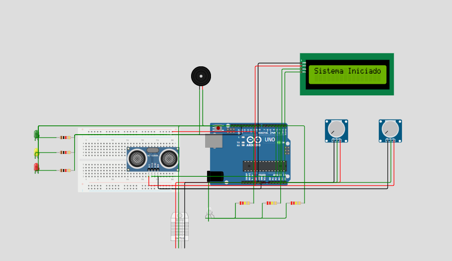

# LNK Tech - Sistema de Alerta de Enchentes

## Descrição do Problema

Enchentes urbanas representam uma séria ameaça em muitas regiões do Brasil, resultando em alagamentos de ruas, danos materiais e riscos à vida. Fatores como chuvas intensas, obstruções no sistema de drenagem e a falta de monitoramento em tempo real dificultam a prevenção e a resposta a esses eventos. 

Há uma grande demanda por sistemas acessíveis e eficazes que permitam monitoramento preventivo e geração de alertas em áreas de risco, principalmente em comunidades carentes onde o impacto das enchentes é mais severo.

## Visão Geral da Solução

A **LNK Tech** apresenta um sistema físico inteligente de monitoramento de riscos de enchentes. Este sistema utiliza sensores ambientais para detectar condições que indicam risco iminente de alagamentos e aciona alarmes visuais e sonoros para alertar a população local.

### Componentes Utilizados

- Sensor DHT22 (temperatura e umidade)
- Sensor ultrassônico (nível da água)
- Potenciômetro (simulando sensor de chuva)
- Sensor de fluxo (simulado no analógico A1)
- LEDs de status (verde, amarelo e vermelho)
- Buzzer para alerta sonoro
- Display LCD I2C 16x2 para exibir mensagens
- LED RGB simulando bomba d’água

### Funcionamento

O sistema realiza a leitura periódica dos sensores e identifica o estado atual do ambiente:

- **Sem chuva:** sistema em estado de repouso.
- **Chuva fraca/forte:** indica chuva sem risco iminente.
- **Risco de enchente:** chuva intensa detectada.
- **Água alta:** nível da água crítico.

Com base nessas leituras, os LEDs indicam o status e o buzzer soa um alarme em caso de emergência. A bomba é ligada virtualmente em caso de água alta ou risco de enchente.

### Ilustração

Abaixo está uma representação visual do circuito físico montado no projeto:




```
[ DHT22 ]      [ ULTRASSÔNICO ]
    |                 |
    |                 |
[ LCD ] -- [ ARDUINO UNO ] -- [ LEDs / Buzzer / Sensores ]
```

## Como Simular o Projeto

Você pode simular este projeto usando o **Wokwi**, uma plataforma online de simulação de circuitos Arduino.

### Passos para simular:

1. Acesse o link do projeto: [Simulação no Wokwi](https://wokwi.com/projects/432149335150942209)
2. Clique em **"Start Simulation"**.
3. Observe os dados no display LCD e no console serial.
4. Altere os valores do potenciômetro para simular chuva.
5. Modifique a posição do sensor ultrassônico para simular o nível da água.

### Link da Simulação

🔗 [https://wokwi.com/projects/432149335150942209](https://wokwi.com/projects/432149335150942209)

### Vídeo Demonstrativo

🎥 *[https://youtu.be/4az9dmW84Cc?feature=shared]*

## Código Fonte

```cpp
// [Código completo colado aqui — veja acima]
```

## Integrantes do Grupo

- **Kevin Carvalho Venancio** - RM: 561459
- **Nicolas Barnabe da Cruz** - RM: 561997
- **Luiz Antônio Morais** - RM: 562142
